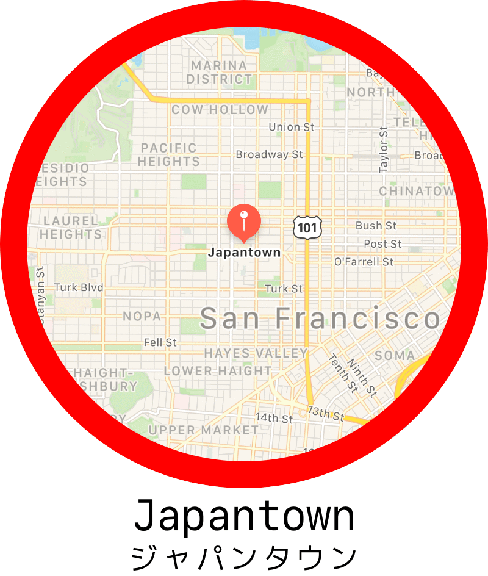
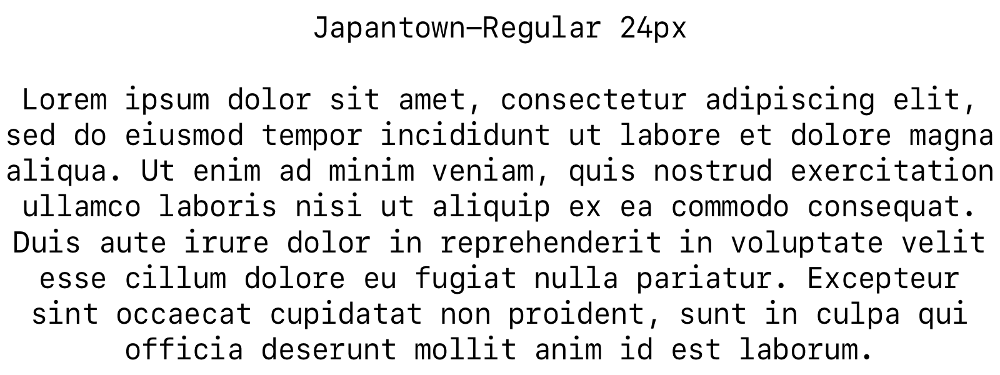
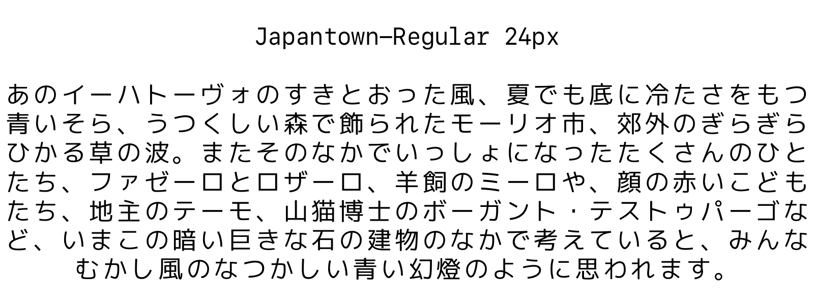

# <p align="center">Japantown</p>
### <p align="center">Condensed Spacing SF Mono + Japanese Glyphs</p>

<p align="center"></p>
<p align="center"></p>
<p align="center"></p>

# Install

```
brew tap aerobounce/Japantown && brew install japantown
```

# Differences from SFMono Fonts
- Supports Japanese glyphs ([mplus-1m](https://mplus-fonts.osdn.jp/about.html))
- Condensed letter spacing
- Some glyphs are customized for readability

# Todo

- [ ] Better way to install
- [ ] Check all the glyphs

# References

### Fonts
- [M+ FONTS PROJECT](https://mplus-fonts.osdn.jp/about.html)
- [Japanese Monospaced Fonts](https://neos21.github.io/japanese-monospaced-fonts/index.html)
- [yuru7/HackGen](https://github.com/yuru7/HackGen)
- [delphinus/homebrew-sfmono-square](https://github.com/delphinus/homebrew-sfmono-square)

### Unicode
- [Unicode Characters in the 'Symbol, Other' Category](https://www.fileformat.info/info/unicode/category/So/list.htm)
- [List of Unicode characters](https://en.wikipedia.org/wiki/List_of_Unicode_characters)

### Font Structure
- [OS/2 Compatibility Table - TrueType Reference Manual - Apple Developer](https://developer.apple.com/fonts/TrueType-Reference-Manual/RM06/Chap6OS2.html)
- [OS/2 and Windows Metrics Table](https://docs.microsoft.com/en-us/typography/opentype/spec/os2)

### FontForge
- [Scripting functions](https://fontforge.org/scripting-alpha.html)
- [Writing python scripts to change fonts in FontForge](https://fontforge.org/en-US/documentation/scripting/python/)
- [Writing python scripts to change fonts in FontForge](http://dmtr.org/ff.php)

### Tools
- [webfont | test](http://webfont-test.com/)

### Others
- [Sublime Text Dev Build 2169](https://forum.sublimetext.com/t/dev-build-2169/4026)
